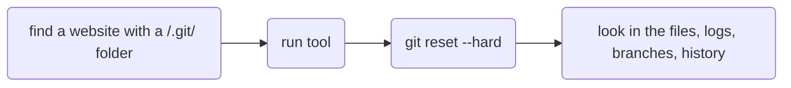

# htb-tools
scripts for HackTheBox / not for any other purpose / not production ready may contain bugs

## git-downloader

Tool used for HackTheBox boxes when the website has a `/.git/ folder, detected by nmap.

